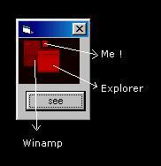



## xray for windows \- see hwnd \!

### Description

Learning about API calls, I have a great idea, see all windows handlers (hwnd), this app get hwnd of all active windows and show as colors, like a X-Rays :D, isn't a good utility but the hours run playing with this !! check out ;)
 
### More Info
 

             |
---                |---
**Submitted On**   |2005-06-12 01:55:56
**By**             |[Gonzalo Arreche](https://github.com/Planet-Source-Code/PSCIndex/blob/master/ByAuthor/gonzalo-arreche.md)
**Level**          |Intermediate
**User Rating**    |5.0 (10 globes from 2 users)
**Compatibility**  |VB 6\.0
**Category**       |[Windows API Call/ Explanation](https://github.com/Planet-Source-Code/PSCIndex/blob/master/ByCategory/windows-api-call-explanation__1-39.md)
**World**          |[Visual Basic](https://github.com/Planet-Source-Code/PSCIndex/blob/master/ByWorld/visual-basic.md)
**Archive File**   |[xray\_for\_w1900966132005\.zip](https://github.com/Planet-Source-Code/gonzalo-arreche-xray-for-windows-see-hwnd__1-61108/archive/master.zip)

